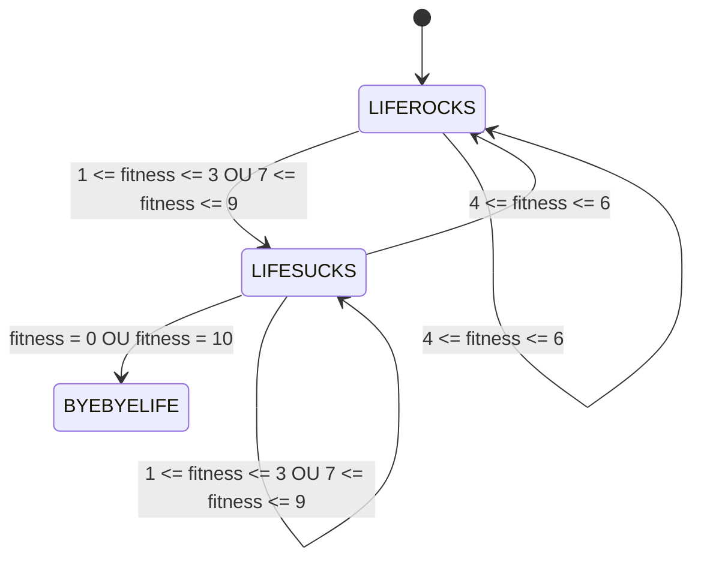

# Compte rendu du projet Cowsay

Classe -> Min-int :

- Rosario Dumont 
- Tess Anderson

## 3. Bash

**cow_kindergarten :**

```
#!/bin/bash

# Initialisation
END=10
# Boucle de 1 à 10 
for i in $( seq 1 $END )  
do
    cowsay $i
    sleep 1
done

cowsay -T U woohoo
```

### Éxécution :

```
./cow_kindergarten.sh
 ___ 
< 1 >
 --- 
        \   ^__^
         \  (oo)\_______
            (__)\       )\/\
                ||----w |
                ||     ||
```
etc, jusqu'à 10

**cow_primaryschool :**

```
#!/bin/bash

for i in $( seq 1 $1 )  
do
    cowsay $i
    sleep 1
done
```

### Éxécution : 

```
./cow_primaryschool.sh 10
 ____ 
< 1 >
 ---- 
        \   ^__^
         \  (oo)\_______
            (__)\       )\/\
                ||----w |
                ||     ||
```
etc, jusqu'à n qui dans ce cas là est égal à 10

**cow_highschool :**

```
#!/bin/bash

for i in $( seq 1 $1 )  
do
    # changement de i en i**2
    i=$((i*i))
    cowsay $i
    sleep 1
done
```

### Éxécution : 

```
./cow_highschool.sh 5
 ____ 
< 25 >
 ---- 
        \   ^__^
         \  (oo)\_______
            (__)\       )\/\
                ||----w |
                ||     ||
```
a prononcé les carrés de 1 à 5, avec 5² = 25 le dernier affichage

**cow_university :**

```
#!/bin/bash

if [ $1 -lt 2 ]; then
    echo "Il y a pas de nombres premiers inférieurs à 2"

else 
    cowsay "2"

    for (( i=3; i<=$1; i+=2 )); do
        # Vérifier si le nombre est premier
        is_prime=true
        for (( j=3; j*j<=i; j+=2 )); do
            if [ $(( i % j )) -eq 0 ]; then	
         	is_prime=false
         	break
            fi
        done
        if $is_prime; then
            cowsay "$i"
        fi
    done
fi
```

### Éxécution : 

```
./cow_university 50
 ____ 
< 47 >
 ---- 
        \   ^__^
         \  (oo)\_______
            (__)\       )\/\
                ||----w |
                ||     ||
```
a affiché tous les nombres premiers inférieurs ou égaux à 50 (l'argument donné), avec 47 étant le dernier

**smart_cow :**

```
#!/bin/bash

# Vérifier si un argument est fourni
if [ $# -eq 0 ]; then
    echo "Pas d'argument fourni"
    exit 1
fi

if [ $# -gt 1 ]; then
    echo "Trop d'arguments fournis"
    exit 1
fi
# Calcul à faire
calcul=$(($1))

# Afficher la vache arithmétique
cowsay -e $calcul $1
```

### Éxécution : 

```
./smart_cow.sh 3+11
 ____ 
< 3+11 >
 ---- 
        \   ^__^
         \  (14)\_______
            (__)\       )\/\
                ||----w |
                ||     ||
```

**crazy_cow :**

```
#!/bin/bash

# On va creer une vache qui, pour chaque nombre n fourni en argument, affiche sa valeur dans la suite de fibonacci définie par f(n) = f(n - 1) + f(n - 2)
# Par exemple, si n = 7, la vache affiche 13 dans ses yeux car f(7) = 13

#Initialisation de la suite de Fibonacci
f0=0 
f1=1

#Boucle qui affiche les nombres de fibonacci jusqu'à l'argument fourni

for f in $( seq 1 $(($1 - 1)) )  
do
  i=$(( $f0 + $f1 ))
  f0=$f1
  f1=$i
done

cowsay -e $i $1
```

### Éxécution : 

```
./crazy_cow.sh 20
 ____ 
< 20 >
 ---- 
        \   ^__^
         \  (67)\_______
            (__)\       )\/\
                ||----w |
                ||     ||
```

### Nos difficultés :

Nous n'avons pas affiché lors des exécutions toutes les vaches affichées dans la partie partie bash car chaque script renvoie exactement ce qui est demandé et cela serait extrèmement long de mettre les étapes intermédiaires lors de l'éxécution de nos scripts. Nous réservons donc le détail des scripts pour la partie en language C.

Par ailleurs, nous n'avons pas rencontré de difficulté notable pour cette partie car les scripts n'étaient pas très complexes. Le script qui as nécessité un certain temps de réflexion serait cow_university car, imbriquer une boucle for dans une autre pour détecter les nombres premiers n'était pas forcément évident.

## 4. C

### Code :

**newcow.c :**

```
#include<stdio.h>


void affiche_vache () {
    printf("                   \\   ^__^\n\
                    \\  (00)\\_______\n\
                       (__)\\       )\\/\\\n\
                           ||----w |\n\
                           ||     ||\n");
    }

void eyes (char* eyes_str) {
    printf("                   \\   ^__^\n\
                    \\  (%s)\\_______\n\
                       (__)\\       )\\/\\\n\
                           ||----w |\n\
                           ||     ||\n", eyes_str);
    }

void amis (char amis_nb) {
    printf("char: %c, number: %d\n", amis_nb, amis_nb);
    if (amis_nb == 48) {
        eyes("XX");
        printf("\n        ( She died because of loneliness ... ) \n");
    } else if (amis_nb == 49) {
        printf("                                               /^ ^\\\n\
                   \\   ^__^                   / 0 0 \\\n\
                    \\  (00)\\_______           V\\ Y /V\n\
                       (__)\\       )\\/\\        / - \\\n\
                           ||----w |           |    \\\n\
                           ||     ||           || (__V\\\n");
    } else if (amis_nb == 50) {
        printf("                                               /^ ^\\\n\
                   \\   ^__^                   / 0 0 \\\n\
                    \\  (00)\\_______           V\\ Y /V         \\    /\\\n\
                       (__)\\       )\\/\\        / - \\           )  ( ')\n\
                           ||----w |           |    \\         (  /  )\n\
                           ||     ||           || (__V\\        \\(__)|\n");
    } else if (amis_nb == 51) {
        printf("                                               /^ ^\\\n\
                   \\   ^__^                   / 0 0 \\\n\
                    \\  (00)\\_______           V\\ Y /V         \\    /\\          _____  \n\
                       (__)\\       )\\/\\        / - \\           )  ( ')      ^..^    \\9\n\
                           ||----w |           |    \\         (  /  )      (oo)_____/ \n\
                           ||     ||           || (__V\\        \\(__)|         WW  WW\n");
    } else if (amis_nb == 52) {
        printf("                                               /^ ^\\\n\
                   \\   ^__^                   / 0 0 \\\n\
                    \\  (00)\\_______           V\\ Y /V         \\    /\\          _____  \n\
                       (__)\\       )\\/\\        / - \\           )  ( ')      ^..^    \\9      _      _      _\n\
                           ||----w |           |    \\         (  /  )      (oo)_____/     >(.)__ <(.)__ =(.)__\n\
                           ||     ||           || (__V\\        \\(__)|         WW  WW       (___/  (___/  (___/\n");
    }
}


int main (int argc, char *argv[]) {
    if ((argc == 3 && argv[1][1] == 101) && (argv[2][2] == '\0')) {
        eyes(argv[2]);
    } else if ((argc == 3 && argv[1][1] == 97 )) {
        if (argv[2][0] < 48) {
            printf("Impossible de lui supprimer des amis ! \n");
        } else if ((argv[2][0] > 52 || argv[2][1] != '\0')) {
            printf("Trop d'amis, impossible de tous les afficher. \n");
        } else {
            amis(argv[2][0]);
        }
    } else {
        affiche_vache();
    }

    return 0;
}
```

### Éxécution :

**Il y a 3 possibilités d'éxécutions différentes après compilation :**

1. `./newcow` (sans paramètres)

                   \   ^__^
                    \  (00)\_______
                       (__)\       )\/\
                           ||----w |
                           ||     ||
On obtient notre vache de base, sans changement.

2. `./newcow -e XX` (-eyes)

                   \   ^__^
                    \  (XX)\_______
                       (__)\       )\/\
                           ||----w |
                           ||     ||
On peut choisir la forme des yeux, renvoie la vache classique si 0 ou 1 ou plus de 2 caractères.

3. `./newcow -a 4` (-amis)

                                               /^ ^\
                   \   ^__^                   / 0 0 \
                    \  (00)\_______           V\ Y /V         \    /\          _____  
                       (__)\       )\/\        / - \           )  ( ')      ^..^    \9      _      _      _
                           ||----w |           |    \         (  /  )      (oo)_____/     >(.)__ <(.)__ =(.)__
                           ||     ||           || (__V\        \(__)|         WW  WW       (___/  (___/  (___/
On peut choisir la quantité d'amis de notre vache à afficher ( de 0 à 4). 
Si le paramètre est >4 alors on recoit : "Trop d'amis, impossible de tous les afficher."

### Remarques et difficultées : 

> Afficher la vache classique tout comme la modification des yeux s'est avéré plutôt simple sans difficultés notable.

> Le choix d'ajouter des amis nous est paru comme une bonne idée originale mais en raison de la difficulté et du temps à créer des animaux en ASCII nous avons utilisé une banque d'ASCII disponible en ligne.

> Il s'est avéré bien plus difficile qu'on ne le pensait de vérifier les paramètres avec argv. En effet, nous avons opté pour une vérification de la quantité de caractère rentré (on en veut qu'un seul) et de vérifier si l'unique caractère est <4. Cela nous a permit de mieux comprendre comment fonctionnait argc et argv en utilisant par exemple : ` argv[1][1]`. 

### Code :

**wildcow.c :**

```
#include <stdio.h>
#include <unistd.h>
#include <string.h>

void update() 
{
    printf("\033[H\033[J");
}

void gotoxy(int x, int y) 
{
    printf("\033[%d;%dH", y, x);
}

void affiche_vache() 
{
    printf("                          ^__^\n\
                          (00)\\_______\n\
                          (__)\\       )\\/\\\n\
                              ||----w |\n\
                              ||     ||\n");
}

void bouge_langue() 
{
    unsigned long t=50000;

    update();
    affiche_vache();
    sleep(1);

    update();
    printf("                          ^__^\n\
                          (00)\\_______\n\
                          (__)\\       )\\/\\\n\
                              ||----w |                     \\\\||//\n\
                              ||     ||                      \\||/\n");

    sleep(2);
    usleep(t+300000);
    update();
    printf("                          ^__^\n\
                          (00)\\____\n\
                          (__)\\    )\\/\n\
                              ||--w|                        \\\\||//\n\
                              ||  ||                         \\||/\n");
    usleep(t);
    update();
    fflush(stdout);
    printf("                         ^__^\n\
                         (00)\\___\n\
                         (__)\\   )\\\n\
                             ||-w|                          \\\\||//\n\
                             || ||                           \\||/\n");
    usleep(t);
    update();
    fflush(stdout);
    printf("                        ^__^\n\
                        (00)__\n\
                        (__)  )\n\
                          ||w|                              \\\\||//\n\
                          || |                               \\||/\n");
    usleep(t);
    update();
    printf("                        ^__^\n\
                        (00)_\n\
                        (__) )\n\
                          |||                               \\\\||//\n\
                          |||                                \\||/\n");
    usleep(t);
    update();
    printf("                       ^__^\n\
                       (00)\n\
                       (__))\n\
                        ||                                  \\\\||//\n\
                        ||                                   \\||/\n");
    usleep(t);
    update();
    printf("                      ^__^\n\
                      (00)\n\
                      (__)\n\
                       ||                                   \\\\||//\n\
                       ||                                    \\||/\n");
    usleep(t);
    update();
    printf("                     ^__^\n\
                     (00)\n\
                    ((__)\n\
                      ||                                    \\\\||//\n\
                      ||                                     \\||/\n");
    usleep(t);
    update();
    printf("                    ^__^\n\
                   _(00)\n\
                  ( (__)\n\
                   |||                                      \\\\||//\n\
                   |||                                       \\||/\n");
    usleep(t);
    update();
    printf("                    ^__^\n\
                  __(00)\n\
                 (  (__)\n\
                  |w||                                      \\\\||//\n\
                  | ||                                       \\||/\n");
    usleep(t);
    update();
    printf("                    ^__^\n\
                ___/(00)\n\
              /(   /(__)\n\
               |w-||                                        \\\\||//\n\
               || ||                                         \\||/\n");
    usleep(t);
    update();
    printf("                    ^__^\n\
               ____/(00)\n\
            \\/(    /(__)\n\
              |w--||                                        \\\\||//\n\
              ||  ||                                         \\||/\n");
    usleep(t);
    update();
    printf("                    ^__^\n\
             ______/(00)\n\
         /\\/(      /(__)\n\
            |w----||                                        \\\\||//\n\
            ||    ||                                         \\||/\n");
    usleep(t);
    update();
    printf("                    ^__^\n\
             ______/(00)\n\
         /\\/(      /(__)\n\
            |w----||                                        \\\\||//\n\
            ||    ||                                         \\||/\n");
    usleep(t);
    update();
    printf("                    ^__^\n\
             ______/(00)\n\
         /\\/(      /(__)\n\
            |w----||                                        \\\\||//\n\
            ||    ||                                         \\||/\n");
    usleep(t);
    update();
    printf("                    ^__^\n\
             ______/(00)\n\
         /\\/(      /(__)\n\
            |w----||                                        \\\\||//\n\
            ||    ||                                         \\||/\n");
    sleep(1);
    update();

    char espace = ' ';
    char ligne[150] = "                                                               ";

    for (int i = 40; i > 2; i--) {
        ligne[i-1] = '\0'; // Supprime le dernier espace

        usleep(100000);
        
        printf("                        ^__^\n\
                 ______/(00)\n\
             /\\/(      /(__)\n\
                /w----/\\%s \\\\||//\n\
               / |   /  | %s\\||/\n", ligne, ligne);
        update();

        usleep(100000);
        
        printf("                        ^__^\n\
                 ______/(00)\n\
             /\\/(      /(__)\n\
                |w----||%s\\\\||//\n\
                ||    ||%s \\||/\n", ligne, ligne);
        update();

        usleep(100000);
        
        printf("                        ^__^\n\
                 ______/(00)\n\
             /\\/(      /(__)\n\
                /w----|\\%s\\\\||//\n\
               |  \\  |  \\%s\\||/\n", ligne, ligne);
        update();

        usleep(100000);
        
        printf("                        ^__^\n\
                 ______/(00)\n\
             /\\/(      /(__)\n\
                |w----||%s\\\\||//\n\
                ||    ||%s \\||/\n", ligne, ligne);
        update();
    }
    sleep(1);

    printf("                        \n\
                 _______ ^__^\n\
             /\\/(       \\(00)\n\
                |w----||__(__)||//\n\
                ||    ||   \\||/\n");
        update();
    sleep(1);

    printf("                        \n\
                 _______ \n\
             /\\/(       \\^__^\n\
                |w----||\\(^^)||//\n\
                ||    || ( 3)|/\n");
        update();
    sleep(2);

}

int main()
{
    bouge_langue();
    return 0;
}
```

### Éxécution :

> Il n'est pas possible de représenter l'éxécution car lorsqu'on l'éxécute il y a beaucoup d'animations comme un dessin-animé, mais on vous conseille d'aller l'éxécuter vous-même, elle en vaut la peine ! 

### Remarques et difficultées : 

> Éditer et modifier l'ASCII de la vache pour effectuer des transitions correctes était INTERMINABLE.

> Mais après avoir effectué cette animation, nous avons constaté qu'il n'y avait pas grand chose de "programmation" mais plus d'une séquence d'affichage. Nous avons donc décidé d'effectuer une boucle pour faire marcher la vache et rapprocher la botte d'herbe (car cela donne une impression de mouvement) en utilisant le positionnement du curseur comme appris auparavant. Cela était donc plus challengeant et plus approprié dans le contexte de notre projet.

### Code :

**reading_cow.c :**

```
#include <stdio.h>
#include <stdlib.h>
#include <unistd.h>
#include <time.h>
#include <string.h>


void update() 
{
    printf("\033[H\033");
}


void gotoxy(int x, int y) 
{
    printf("\033[%d;%dH", y, x);
}


void affiche_vache(char* lettre) 
{
    update();
    gotoxy(5, 5);
    printf("        \\  ^__^\n\
             \\ (00)\\_______\n\
               (__)\\       )\\/\\\n\
                %c  ||----w |\n\
                   ||     ||\n", *lettre);
    sleep(1);
    gotoxy(17, 8);
    printf(" \n");
    gotoxy(17, 7);
    printf("%c\n", *lettre);
    sleep(1);
}

void lireFichier(const char* nomFichier)
{
    FILE* fichier = fopen(nomFichier, "r");
    if (fichier == NULL) {
        printf("Impossible d'ouvrir le fichier\n");
        return;
    }

    char caractere;
    char variable[100]; // Modifier la taille selon vos besoins
    int index = 0;

    while ((caractere = fgetc(fichier)) != EOF) {
        variable[index++] = caractere;
        system("clear");
        printf(" -");
        for (int i = 0; i < index; i++) {
            printf("-");
        }
        printf("\n");
        printf("< ");
        int longueur = strlen(variable);
        if (longueur > 0) {
           printf("%.*s", longueur - 1, variable);
        }
        printf(" >\n -");
        for (int i = 0; i < index; i++) {
            printf("-");
        }
        printf("\n");
        affiche_vache(&caractere);
        sleep(1);
    }

    variable[index] = '\0'; // Ajoute le caractère de fin de chaîne

    fclose(fichier);
}


int main ()
{
    const char* nomFichier = "fichier.txt";

    lireFichier(nomFichier);

    return 0;
}
```

### Éxécution : 

```
 -------------------
< Une bonne note sv >
 -------------------

            \  ^__^
             \ (00)\_______
               (__)\       )\/\
                p  ||----w |
                   ||     ||
```

> Pour améliorer notre programme nous avons pensé à effectué une animation en plus en faisant passer la lettre dans la bouche de la vache pour donner une réel impression de macher la nourriture. 

### Remarques et difficultées

> Cette transition s'est avérée assez difficile car il a fallu utiliser gotoxy encore une fois pour donner un effet de disparition devant la bouche puis apparition dans la bouche tout en implémentant une fonction pour afficher la phrase à -1 lettre sinon il y avait un mauvais décalage.

## 5. Automates

**Introduction :**

> Nous avons décider de suivre en partie les conseils de séquence proposé dans les consignes du projet. C'est pourquoi certaines fonctions n'ont pas forcément les noms proposés.

**Schéma de l'automate:**



### Code

**tamagoshi_cow.c**

```
#include <stdio.h>
#include <stdlib.h>
#include <unistd.h>
#include <string.h>
#include <time.h>
#include <ctype.h>


// DÉFINITION DE NOS ÉTATS
#define BYEBYELIFE 0
#define LIFESUCKS 1
#define LIFEROCKS 2

// DÉFINITION DE NOTRE STRUCTURE DE JOUEUR
#define MAX_JOUEURS 10
#define TAILLE_NOM 50

#define TAILLE_MAX_PHRASE 150

// REPRÉSENTE LES INFORMATIONS D'UN JOUEUR
// CONTIENT DEUX MEMBRES
struct Joueur {
    char nom[TAILLE_NOM]; // Le nom du joueur
    int score; // Le score du joueur
};


// AFFICHE LA CHAÎNE DE CARACTÈRES LETTRE PAR LETTRE AVEC UN DÉLAI ENTRE CHAQUE LETTRES
void afficherLettreParLettre(const char* phrase, int delai) 
{
    int longueur = strlen(phrase); // Obtient la longueur de la phrase
    for (int i = 0; i < longueur; i++) {
        printf("%c", phrase[i]); // Affiche le caractère actuel de la phrase
        fflush(stdout); // Vide le tampon de sortie pour afficher immédiatement le caractère

        usleep(delai * 1000); // Pause de temps en millisecondes entre l'affichage de chaque caractère
    }
    printf("\n"); // Nouvelle ligne après avoir affiché tous les caractères de la phrase
}


// SAISIR LES NOMS DES JOUEURS ET LES ASSOCIER À DES STRUCTURES 'Joueurs'
void saisirNomsJoueurs(struct Joueur* joueurs, int* nbJoueurs) 
{
    char nom[TAILLE_NOM]; // Variable locale pour stocker le nom temporaire du joueur

    *nbJoueurs = 0; // Initialise le nombre de joueurs à 0

    printf("Saisissez le nom du joueur %d (ou 'stop' pour arrêter) : ", *nbJoueurs + 1);
    fgets(nom, sizeof(nom), stdin); // Lit la saisie du joueur
    nom[strcspn(nom, "\n")] = '\0'; // Supprime le caractère de nouvelle ligne de la saisie

    while (strcmp(nom, "stop") != 0 && *nbJoueurs < MAX_JOUEURS) {
        strcpy(joueurs[*nbJoueurs].nom, nom); // Copie le nom saisi dans la structure du joueur actuel
        joueurs[*nbJoueurs].score = 0; // Initialise le score du joueur actuel à 0
        (*nbJoueurs)++; // Incrémente le nombre de joueurs

        printf("Saisissez le nom du joueur %d (ou 'stop' pour arrêter) : ", *nbJoueurs + 1);
        fgets(nom, sizeof(nom), stdin); // Lit la saisie du joueur
        nom[strcspn(nom, "\n")] = '\0'; // Supprime le caractère de nouvelle ligne de la saisie
    }
    printf("\n");
}


// DEMANDE ET SI 'OUI' AFFICHE LES RÈGLES DU JEU
void regles(char* reponse) 
{
    char phrase[TAILLE_MAX_PHRASE];
    int delai = 50; // Délai entre chaque lettre en millisecondes

    for (int i = 0; i < strlen(reponse); i++) {
        reponse[i] = tolower(reponse[i]); // Convertit la réponse en minuscules
    }

    while (strcmp(reponse, "oui") != 0 && strcmp(reponse, "non") != 0 &&
           strcmp(reponse, "o") != 0 && strcmp(reponse, "n") != 0) {
        printf("Réponse invalide. Veuillez réessayer : ");
        scanf("%s", reponse);
        for (int i = 0; i < strlen(reponse); i++) {
            reponse[i] = tolower(reponse[i]); // Convertit la réponse en minuscules
        }
    }

    if (strcmp(reponse, "oui") == 0 || strcmp(reponse, "o") == 0) {
        // Affiche les règles du jeu
        char phrase[] = "But du jeu :";
        afficherLettreParLettre(phrase, delai);
        printf("    -> faire survivre votre vache le plus longtemps possible en maintenant un bon niveau de santé\n\n");
        strcpy(phrase, "Comment jouer?");
        afficherLettreParLettre(phrase, delai);
        printf("    -> nourrir la vache à chaque tour en fonction de vos réserves disponibles\n");
        printf("    -> votre stock de nourriture peut augmenter au début de votre tour\n\n");
        strcpy(phrase, "Difficultés :");
        afficherLettreParLettre(phrase, delai);
        printf("    -> votre vache peut digérer difficilement et ainsi perdre en niveau de santé\n");
        printf("    -> vos réserves de nourriture peuvent devenir avariées\n");
        printf("    -> si votre vache atteint 0 de niveau de santé, elle meurt de faim, à 10 de suralimentation\n\n\n");
    }

    int c;
    while ((c = getchar()) != '\n' && c != EOF) {} // Vide le tampon d'entrée

    printf("\n");
    strcpy(phrase, "Appuyez sur Entrée pour continuer...");
    afficherLettreParLettre(phrase, delai);
    getchar(); // Attend la pression de la touche Entrée

    strcpy(phrase, "Début de la partie!");
    afficherLettreParLettre(phrase, delai); // Affiche la phrase lettre par lettre avec un délai

    sleep(1); // Pause d'une seconde
}


// AFFICHE UNE REPRÉSENTATION DE VACHE EN FONCTION DE L'ÉTAT DE CELLE-CI
void affiche_vache(int* etat)
{
    if (*etat == BYEBYELIFE)
    {
        // Affiche une représentation de vache lorsque l'état est BYEBYELIFE
        printf("                           \n\
                            ________\n\
                      ^__^/         )----- \n\
                      (XX)/||----w |\n\
                      (__) ||     ||\n\
                        U\n");
    } 
    else if (*etat == LIFESUCKS) 
    {
        // Affiche une représentation de vache lorsque l'état est LIFESUCKS
        printf("                           \n\
                           _________\n\
                      ^__^/         )\\/\\\n\
                      (~~)/||----w |\n\
                      ( _) ||     ||\n\n");
    } 
    else if (*etat == LIFEROCKS) 
    {
        // Affiche une représentation de vache lorsque l'état est LIFEROCKS
        printf("                       ^__^\n\
                       (^^)\\_______\n\
                       (__)\\       )\\/\\\n\
                           ||----w |\n\
                           ||     ||\n\n");
    }
}


// DEMANDE AU JOUEUR QUELLE QUANTITÉ DE NOURRITURE DONNER À LA VACHE
int quantiteNourrir(int* stock)
{
    char phrase[TAILLE_MAX_PHRASE];
    int delai = 50; // Délai entre chaque lettre en millisecondes

    int donner = 0;

    if (*stock == 0) {
        char phrase[] = "Votre stock est de 0, nourriture en vue?";
        afficherLettreParLettre(phrase, delai);
        printf("\n");
    } else {
        printf("\n");
        char phrase[] = "Quelle quantité souhaitez-vous donner à manger?";
        afficherLettreParLettre(phrase, delai);
        sleep(1);
        printf("Entrez un nombre entre 0 et %d -> ", *stock);
        scanf("%d", &donner);
        printf("\n");
    }

    return donner;
}


// MET À JOUR LE STOCK DE NOURRITURE APRÈS AVOIR CHOISI LA QUANTITÉ DE NOURRITURE À DONNER
void stockApresNourriture(int* stock, int* nourrir)
{
    *stock -= *nourrir; // Réduit le stock de nourriture en fonction de la quantité donnée (*nourrir)

    if (*stock < 0) {
        *stock = 0; // Si le stock devient négatif, le stock est mis à 0 pour éviter les valeurs négatives
    }
}


// SIMULATION DE L'ÉVOLUTION DU STOCK DE NOURRITURE AVEC LES CHANGEMENTS
void evolutionStock(int* stock)
{
    char phrase[TAILLE_MAX_PHRASE] = " ";
    int delai = 50; // Délai entre chaque lettre en millisecondes

    srand(time(NULL)); // Initialise le générateur de nombres aléatoires avec une graine basée sur l'heure actuelle
    int increment = rand() % 7 - 3; // Génère un nombre aléatoire entre -3 et 3

    if (increment <= 0 && *stock == 0) {
        // Cas où l'incrémentation est négative et le stock est déjà à 0
        strcpy(phrase, "Aucune aide pour ce tour et stock à 0, solitude?");
        afficherLettreParLettre(phrase, delai);
        sleep(2);
        strcpy(phrase, "Il semblerait ...");
        afficherLettreParLettre(phrase, delai);
        printf("\n");
        sleep(1);
        strcpy(phrase, "Moment difficile ...");
        afficherLettreParLettre(phrase, delai);
        printf("\n");
        sleep(2);
        strcpy(phrase, "Mort en vue?");
        afficherLettreParLettre(phrase, delai);
        printf("\n");
        sleep(1);
        strcpy(phrase, "Aucune action possible, le tour passe ...");
        afficherLettreParLettre(phrase, delai);
        printf("\n");
        sleep(1);
    } else if (increment < 0) {
        // Cas où l'incrémentation est négative
        strcpy(phrase, "Pas de chance, votre stock est avarié...");
        afficherLettreParLettre(phrase, delai);
        sleep(1);
        printf("Vous perdez %d unité(s)\n\n", increment);
    } else if (increment > 0) {
        // Cas où l'incrémentation est positive
        printf("Super ! Vous avez gagné %d unité(s)\n", increment);
    } else if (increment == 0 && *stock != 0) {
        // Cas où l'incrémentation est nulle mais le stock n'est pas vide
        strcpy(phrase, "Pas de stock en moins ni en plus pour ce tour ...");
        afficherLettreParLettre(phrase, delai);
        sleep(1);
        strcpy(phrase, "Si vous avez fait des provisions, tout va bien !");
        afficherLettreParLettre(phrase, delai);
    } else if (increment == 0 && *stock > 0) {
        // Cas où l'incrémentation est nulle et le stock est supérieur à 0
        strcpy(phrase, "Moment difficile ...");
        afficherLettreParLettre(phrase, delai);
        printf("\n");
    }

    *stock = *stock + increment; // Met à jour le stock en ajoutant l'incrémentation

    if (*stock < 0) {
        *stock = 0; // Réinitialise le stock à 0 s'il devient négatif
    } else if (*stock > 10) {
        *stock = 10; // Limite le stock à une valeur maximale de 10
    }

    sleep(1);
    printf("Il vous reste donc %d unité(s)\n", *stock);
}


// SIMULATION DU PROCESSUS DE DIGESTION DE LA VACHE
// RETOURNE UN PARAMÈTRE ALÉATOIRE
int digestion()
{
    srand(time(NULL)); // Initialise le générateur de nombres aléatoires avec une graine basée sur l'heure actuelle

    int val_digestion = rand() % 4; // Génère un nombre aléatoire entre 0 et 3

    return -val_digestion; // Retourne la valeur de digestion avec un signe négatif
}


// MET À JOUR LE NIVEAU DE SANTÉ DE LA VACHE EN FONCTION DE LA QUANTITÉ DONNÉE ET LA DIGESTION
void niveauDeSante(int* fitness, int* nourrir, int* val_digestion)
{
    *fitness = (*fitness + *nourrir) + *val_digestion; // Met à jour le niveau de santé en ajoutant la quantité nourrie et la valeur de digestion

    if (*fitness < 0) {
        *fitness = 0; // Réinitialise le niveau de santé à 0 s'il devient négatif
    } else if (*fitness > 10) {
        *fitness = 10; // Limite le niveau de santé à une valeur maximale de 10
    }
}


// DÉTERMINE L'ÉTAT DE LA VACHE EN FONCTION DE SON NIVEAU DE SANTÉ
void changementEtat(int* fitness, int* etat)
{
    if (*fitness == 0 || *fitness == 10) {
        *etat = BYEBYELIFE; // Si le niveau de santé est à 0 ou à 10, l'état est défini comme BYEBYELIFE
    } else if ((*fitness >= 1 && *fitness <= 3) || (*fitness >= 7 && *fitness <= 9)) {
        *etat = LIFESUCKS; // Si le niveau de santé est entre 1 et 3 ou entre 7 et 9, l'état est défini comme LIFESUCKS
    } else if (*fitness >= 4 && *fitness <= 6) {
        *etat = LIFEROCKS; // Si le niveau de santé est entre 4 et 6, l'état est défini comme LIFEROCKS
    }
}


// CYCLE DE VIE D'UN JEU POUR UN JOUEUR
// S'ÉXÉCUTE TANT QUE LA VACHE N'EST PAS MORTE
int automate(int* stock, int* fitness, int* etat, int* nourrir, int* val_digestion, int* score)
{
    char phrase[TAILLE_MAX_PHRASE] = " ";
    int delai = 50; // Délai entre chaque lettre en millisecondes

    while (*etat != BYEBYELIFE) // Tant que l'état de la vache n'est pas BYEBYELIFE
    {
        switch (*etat)
        {
            case LIFESUCKS:
                printf("\n");
                affiche_vache(etat); // Affiche la vache dans son état actuel
                sleep(1);
                if (*etat == 0) {
                    strcpy(phrase, "Comme un sentiment de fin, au revoir");
                    afficherLettreParLettre(phrase, delai);
                    return *score; // Si l'état est devenu 0, c'est la fin de la partie, le score est retourné
                }
                *nourrir = quantiteNourrir(stock); // Demande au joueur de saisir la quantité de nourriture à donner
                sleep(1);
                stockApresNourriture(stock, nourrir); // Met à jour le stock de nourriture après le repas
                evolutionStock(stock); // Fait évoluer le stock de nourriture pour le tour suivant
                sleep(2);
                system("clear"); // Efface l'écran pour la prochaine étape
                *val_digestion = digestion(); // Génère une valeur aléatoire pour la digestion
                niveauDeSante(fitness, nourrir, val_digestion); // Met à jour le niveau de santé de la vache
                changementEtat(fitness, etat); // Met à jour l'état de la vache en fonction du niveau de santé
                (*score)++; // Incrémente le score
                break;

            case LIFEROCKS:
                printf("\n");
                affiche_vache(etat); // Affiche la vache dans son état actuel
                sleep(1);
                if (*etat == 0) {
                    strcpy(phrase, "Comme un sentiment de fin, au revoir");
                    afficherLettreParLettre(phrase, delai);
                    return *score; // Si l'état est devenu 0, c'est la fin de la partie, le score est retourné
                }
                *nourrir = quantiteNourrir(stock); // Demande au joueur de saisir la quantité de nourriture à donner
                sleep(1);
                stockApresNourriture(stock, nourrir); // Met à jour le stock de nourriture après le repas
                evolutionStock(stock); // Fait évoluer le stock de nourriture pour le tour suivant
                sleep(2);
                system("clear"); // Efface l'écran pour la prochaine étape
                *val_digestion = digestion(); // Génère une valeur aléatoire pour la digestion
                niveauDeSante(fitness, nourrir, val_digestion); // Met à jour le niveau de santé de la vache
                changementEtat(fitness, etat); // Met à jour l'état de la vache en fonction du niveau de santé
                (*score)++; // Incrémente le score
                break;           
        }
    }
    return *score; // Retourne le score final de la partie
}


// FONCTION MAIN
int main()
{
    char phrase[TAILLE_MAX_PHRASE] = " ";
    int delai = 50; // Délai entre chaque lettre en millisecondes

    struct Joueur joueurs[MAX_JOUEURS];  // Tableau de joueurs
    int nbJoueurs;  // Nombre de joueurs saisis

    system("clear");  // Efface l'écran
    saisirNomsJoueurs(joueurs, &nbJoueurs);  // Saisie des noms des joueurs
    strcpy(phrase, "Liste des joueurs :");
    afficherLettreParLettre(phrase, delai);

    for (int i = 0; i < nbJoueurs; i++) {
        printf("    Joueur %d -> %s\n", i + 1, joueurs[i].nom);  // Affichage des noms des joueurs
        sleep(1);  // Pause d'une seconde
    }
    sleep(1);  // Pause d'une seconde

    // Boucle principale pour chaque joueur
    for (int i = 0; i < nbJoueurs; i++) {
        
        int etat = LIFEROCKS;  // État initial de la vache du joueur
        int stock = 5;  // Stock initial de nourriture
        int fitness = 5;  // Niveau de santé initial de la vache
        int score = 0;  // Score du joueur
        
        char reponse[10];  // Variable pour stocker la réponse du joueur
        int nourrir;  // Quantité de nourriture à donner à la vache
        int val_digestion;  // Valeur de la digestion

        // INITIALISATION POUR LE DÉBUT DE PARTIE
        system("clear");  // Efface l'écran
        sleep(1);  // Pause d'une seconde
        printf("C'est à %s de jouer\n\n", joueurs[i].nom);  // Affichage du nom du joueur en cours
        sleep(1);  // Pause d'une seconde
        strcpy(phrase, "Afficher les règles du jeu?\n[Oui(o)/Non(n)] :");
        afficherLettreParLettre(phrase, delai);
        scanf("%s", reponse);
        regles(reponse);  // Affichage des règles du jeu si demandé par le joueur
        system("clear");  // Efface l'écran
        printf("Voici votre stock de départ -> %d unités\n", stock);
        sleep(1);  // Pause d'une seconde

        // FONCTION PRINCIPAL DE L'AUTOMATE
        score = automate(&stock, &fitness, &etat, &nourrir, &val_digestion, &score);  // Exécution du jeu pour le joueur
        joueurs[i].score = score - 1;  // Enregistrement du score du joueur
        system("clear");  // Efface l'écran

        // AFFICHAGE DU MESSAGE DE FIN
        affiche_vache(&etat);  // Affichage de l'état final de la vache
        sleep(2);  // Pause de deux secondes
        printf("\n\n");
        printf("Fin de partie\n\n");
        sleep(1);  // Pause d'une seconde

        // Affichage du message de fin en fonction du niveau de santé de la vache
        if (fitness == 0) {
            strcpy(phrase, "Votre vache s'allonge péniblement et s'endort");
            afficherLettreParLettre(phrase, delai);
            printf("\n");
            sleep(1);
            printf(".\n");
            sleep(1);
            printf(".\n");
            sleep(1);
            printf(".\n\n");
            sleep(1);
            strcpy(phrase, "Elle est morte de faim");
            afficherLettreParLettre(phrase, delai);
            printf("\n");
        } else if (fitness == 10) {
            strcpy(phrase, "Il y en a même jusqu'au plafond ... ?");
            afficherLettreParLettre(phrase, delai);
            printf("\n");
            sleep(1);
            printf(".\n");
            sleep(1);
            printf(".\n");
            sleep(1);
            printf(".\n\n");
            strcpy(phrase, "Explosion très probable!");
            afficherLettreParLettre(phrase, delai);
            printf("\n");
        }
        sleep(1);
        printf("Votre score : %d\n", score - 1);
        sleep(2);
    }
    system("clear");

    // FIN ET AFFICHAGE DES SCORES
    strcpy(phrase, "Scores des joueurs :");
    afficherLettreParLettre(phrase, delai);
    printf("\n");
    sleep(1);
    for (int i = 0; i < nbJoueurs; i++) {
        printf("    %s -> %d\n\n", joueurs[i].nom, joueurs[i].score);
        sleep(1);
    }
    printf("\n");
    strcpy(phrase, "Merci d'avoir joué :)");
    afficherLettreParLettre(phrase, delai);

    return 0;
}
```

### Éxécution

> Il n'est pas non plus possible d'afficher l'éxécution de ce programme au vu de sa complexité et de son nombre de possibilité.

###  Remarques et difficultées

**Nous avons procédé de la manière suivante pour développer ce programme :**

1. Création du "squelette" de l'automate avec ses 3 états possibles :
> - design des 3 états
> - switch et case
> - initialisation et fin
> - création des variables stock et fitness
- Interaction utilisateur et changements d'états
> - fonctions pour changer le stock, nourir et actualiser fitness
> - fonction digestion et implémentation de l'aléatoire
- Changement et ajout pour "ressembler à un jeu"
> - création de tout les dialogues et interractions programme - utilisateur
> - Fin et début amélioré
> - variable score
- Bonus et améliorations
> - mise en place d'une possibilité 'multijoueurs' avec une structure pour les noms et scores
> - demande si l'utisateur veut voir les règles du jeu au début de la partie
> - implémentation d'une fonction pour afficher les dialogues sans variables à la manière d'un jeu vidéo (référence : Undertale et vieux jeux)

Il est intéressant de noter qu'à la manière de notre premier projet lors du premier semestre, nous avions utilisés gitlab afin de bien mieux travailler en duo. Cela nous a d'ailleurs permis de s'améliorer nettement sur l'utilisation de l'outil git, étant donné que la dernière fois nous avions eut beaucoup d'erreur d'overwrite avec merge.

**Difficultées :**

> Le programme devenait vraiment complexe au fur et à mesure mais grâce à notre habitude de commenter nos fonctions et lignes continuellement, il était bien plus simple de comprendre le travail de l'autre et de s'y retrouver.

Difficulté par fonctions :
 
- **saisirNomsJoueurs** : 
> Pas de difficultés notable.

- **regles** : 
> Inclure le fait que la réponse ne soit pas case-sensitive et que l'on puisse entrer Oui ou "o"
> Découverte de getchar().

- **affiche_vache** :
> Aucune difficulté si ce n'est pour être simple à comprendre visuellement dans l'état de la vache.

- **quantiteNourrir** :
> Aucune difficulté non plus. Une condition a été ajouté pour afficher un message ne laissant pas le choix lorsque on ne peut rien donner.

- **stockApresNourriture** :
> On garde le stock à 0 si on soustrait d'avantage.

- **evolutionStock** :
> La difficulté ici était de trouver toutes les conditions pour afficher un message cohérent. 
> Même chose pour la variable stock, on la garde à 0.

- **digestion** :
> Renvoyer un nombre aléatoire nous a été donné dans l'ennoncé.

- **niveauDeSanté** :
> Fonction simple.

- **automate** :
> Très clairement la fonction la plus difficle car il fallait trouver les bons moyens d'appel de fonction et de variable en utilisant bien les pointeurs *, les adresses & et les noms de variables. 
> Nous avions initialement mis le cas BYEBYELIFE mais il s'est avéré inutile car nous avions juste besoin de mettre "`while (*etat != BYEBYELIFE)`".
> Il fallait faire appel à la plupart de nos fonctions dans le bon ordre et trouver où placer la condition de fin.

- **main** :
> C'est notre fonction principal donc nous avons appelé notre fonction automate.
> Boucler pour permettre à chaque joueur de jouer n'a pas été évident.
> Réussir à appeler le score de tous les joueurs n'a non plus été simple.

- **afficherLettreParLettre** : 
> Il est important pour nous de souligner que cette fonction a pu être réaliser grâce à (ou à cause de) chatGPT car la commande "fflush" était très difficile à comprendre et nous avions besion d'un modèle qui nous a permis de l'incorporer dans notre fonction. Nous n'avions pas réussi à trouver l'algorithme pour reproduire cet effet d'affichage.

### Remarques :

> Notre fonction "principale" est basée sur le principe d'un automate. Cependant étant donné le peu d'état de notre automate, nous avions l'impression qu'il n'était pas forcément nécessaire voir même utile d'utiliser switch etc ...En effet, si on enlève le cas de fin BYEBYELIFE, il ne reste que deux états qui, au final, se ressemblent dans la programmation car ils vérifient principalement les mêmes choses. Peut-être que l'erreur vient d'une incompréhension de notre part.

> Lorsque notre stock arrive à 0 et que nous ne recevons pas de nourriture, il est probable que l'algorithme fasse -3, -2 ou -1. Or, d'un point de vue du joueur, cela peut-être assez frustrant car de temps en temps on perd la main durant 3-4 tour. Il aurait sûrement été plus pertinent de diminuer les nouvelles rations lorsqu'on arrive à 0 dans une plage de 0 à 1 ou 2 par exemple. Cela aurait rendu le jeu un peu plus simple mais moins frustrant.

